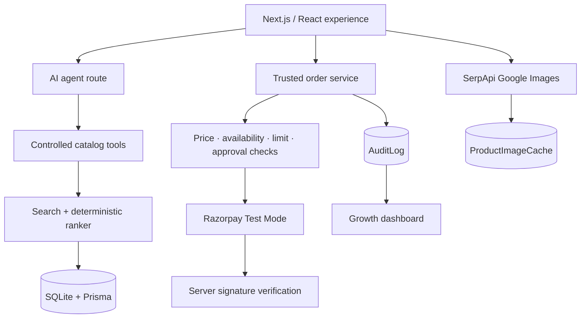

# BuyFlow — AI Shopping, With Proof

> **Tell us what you want. We’ll find it — and explain every money-moving decision.**

BuyFlow is an AI-assisted commerce experience built for the **AI Growth & Agentic Commerce** track. It converts natural-language shopping requests into catalog-aware recommendations, lets shoppers compare options, proposes category-relevant additions, and completes a guarded Razorpay Test Mode payment flow.

The project is designed around a simple principle: **AI can guide the shopper, but it never gets to silently spend their money.**

## Why BuyFlow

Modern shopping assistants often make recommendations without making their logic, prices, or payment decisions visible. BuyFlow makes the full journey inspectable:

- **Conversational discovery** — search using everyday language such as “a shampoo for dry hair under ₹500”.
- **Hard catalog constraints** — category, availability, price, brand, and deterministic ranking are enforced on the server.
- **Relevant cross-sell** — complementary suggestions stay within the selected product’s domain.
- **Explicit approval** — a shopper must approve a trusted server-side order before Checkout opens.
- **Safe payment handoff** — Razorpay Test Mode order creation and signature verification happen server-side.
- **Visible accountability** — actions are written to an audit log and reflected in event-derived growth metrics.

## Product journey

```mermaid
flowchart LR
  A[Shopper request] --> B[AI intent + controlled tools]
  B --> C[Catalog filters]
  C --> D[Deterministic ranking]
  D --> E[Visual comparison]
  E --> F[Category-aware recommendation]
  F --> G[Explicit approval]
  G --> H[Server policy checks]
  H --> I[Razorpay Test Mode]
  I --> J[Signature verification]
  J --> K[Order confirmation + audit trail]
  K --> L[Event-derived growth metrics]
```



## What makes it agentic — and safe

| Layer | What BuyFlow does | What it deliberately does not do |
| --- | --- | --- |
| AI agent | Interprets a request and calls controlled catalog tools | Write to the database, set prices, approve payments, or mark orders paid |
| Catalog | Applies category/brand/budget/availability filters before ranking | Claim historical catalog pricing is live marketplace pricing |
| Purchase | Builds an order only from the trusted database price | Trust client-supplied totals or a model-generated amount |
| Payment | Creates Razorpay Test Mode orders and verifies HMAC signatures | Mark a payment successful from a browser callback alone |
| Growth | Derives metrics from real audit and order events | Start with seeded revenue, orders, or upsell metrics |

## Key features

### AI product discovery

- Groq-compatible tool-calling agent with a deterministic fallback mode.
- Structured intent parsing for category, brand, budget, availability, and preference.
- Deterministic score built from price, discount, relevance, availability, and seller signals.
- Plain-language answer UI; the product interface renders the actual catalog results separately.

### Product intelligence

- 29,339-row historical catalog import with robust quoted/multiline UTF-8 CSV parsing.
- Six supported shopping domains: Skin Care, Hair Care, Fragrance, Bath & Shower, Grocery & Gourmet Foods, and Detergents & Dishwash.
- Side-by-side comparison with visible price, discount, availability, seller count, and ranking score.
- Lazy SerpApi Google Images lookup, cached per product in SQLite. Product image search is never performed during the initial catalog import.

### Controlled commerce

- Server-calculated trusted totals and stock checks.
- Default ₹10,000 transaction policy (`MAX_TRANSACTION_AMOUNT`).
- Explicit order states: `PENDING_APPROVAL → APPROVED → PAYMENT_CREATED/PAYMENT_PROCESSING → PAID` or `PAYMENT_FAILED`.
- Idempotency protection and one bounded retry path.
- Same product can be purchased again: payment status belongs to an **order**, never to a product.

### Razorpay Test Mode

- Server-side Razorpay order creation in paise.
- BuyFlow-branded Checkout handoff.
- Server-side HMAC SHA-256 signature verification before `PAID` is recorded.
- Checkout dismissal/failure is recorded as unpaid.
- Optional signed webhook reconciliation at `/api/webhooks/razorpay`.

## Architecture



## Tech stack

- **Frontend:** Next.js 15, React 19, TypeScript
- **Backend:** Next.js route handlers
- **Database:** SQLite + Prisma
- **AI:** Groq OpenAI-compatible tool calling, deterministic fallback
- **Payments:** Razorpay Node SDK, Test Mode
- **Image enrichment:** SerpApi Google Images, lazy cached lookups
- **Validation/testing:** Zod, Vitest, ESLint, TypeScript

## Repository map

| Path | Purpose |
| --- | --- |
| `app/page.tsx` | BuyFlow shopping experience, comparison, purchase approval, audit, and growth UI |
| `app/api/agent` | Controlled AI orchestration endpoint |
| `app/api/catalog` | Catalog search, comparison, product, category, complementary-product, and image APIs |
| `app/api/orders` | Order proposal, approval, payment, verification, and failure endpoints |
| `app/api/webhooks/razorpay` | Signed Razorpay webhook receiver |
| `lib/catalog.ts` | Intent parsing, filters, and deterministic ranking |
| `lib/ai.ts` | Tool-calling agent and safe demo fallback |
| `lib/orders.ts` | Trusted order state machine and Razorpay verification |
| `lib/images.ts` | Cached product-specific SerpApi image enrichment |
| `prisma/schema.prisma` | Product, order, audit, webhook, and image-cache data model |
| `scripts/import-data.ts` | Idempotent production-grade CSV importer |
| `scripts/reset-activity.ts` | Activity-only reset; preserves the catalog |

## Quick start

### Prerequisites

- Node.js 20+
- npm

### Run locally

```powershell
npm install
Copy-Item .env.example .env
npm run db:push
npm run dev
```

Open [http://localhost:3000](http://localhost:3000).

### Import the catalog

Place `cleaned_dataset.csv` in the repository root, then run:

```powershell
npm run import:data
```

The importer supports quoted fields, embedded commas, escaped quotes, multiline fields, and UTF-8. It validates records, normalizes searchable fields, derives discounts, and upserts by the dataset’s unique ID. It never modifies the source CSV.

### Start with clean activity

This removes only past orders, audit events, and webhook event state — never the catalog:

```powershell
npm run reset:activity
```

## Environment configuration

Copy `.env.example` to `.env`; do not commit `.env`.

| Variable | Required for | Notes |
| --- | --- | --- |
| `DATABASE_URL` | Local database | Defaults to the SQLite database path |
| `GROQ_API_KEY` | Live AI tool calling | Without it, BuyFlow uses deterministic demo mode |
| `GROQ_MODEL` | AI model choice | Defaults to `openai/gpt-oss-20b` |
| `SERPAPI_API_KEY` | Product-specific Google Images | Server-only; results are cached per product |
| `RAZORPAY_KEY_ID` | Razorpay Test Mode | Use test credentials only |
| `RAZORPAY_KEY_SECRET` | Razorpay signature verification | Server-only, never expose it |
| `NEXT_PUBLIC_RAZORPAY_KEY_ID` | Razorpay Checkout | The only Razorpay key allowed in the browser |
| `RAZORPAY_WEBHOOK_SECRET` | Webhook verification | Optional but recommended for reconciliation |
| `MAX_TRANSACTION_AMOUNT` | Spending policy | Defaults to `10000` INR |

> **Security note:** Never commit API keys, payment secrets, or `.env`. Rotate any secret that has been pasted into an issue, chat, commit, or public repository.

## Demo script for judges

1. Open the app and ask: `Find me a shampoo for dry hair under ₹500`.
2. Review the ranked product cards and open a product for detail.
3. Select up to three products and open **Compare** to inspect deterministic decision signals.
4. Select a product to see a same-category complementary recommendation.
5. Choose whether to include it — it is never added automatically.
6. Review the protected checkout card and explicitly approve the order.
7. Complete Razorpay **Test Mode** Checkout.
8. Open **Audit** to inspect the trail and **Growth** to view event-derived metrics.

## API surface

| Endpoint | Description |
| --- | --- |
| `POST /api/agent` | Natural-language request → controlled catalog search |
| `GET /api/catalog/search` | Safe structured search filters |
| `GET /api/catalog/compare?ids=…` | Deterministically scored comparison data |
| `GET /api/catalog/products/:id` | Product detail |
| `GET /api/catalog/products/:id/complementary` | Domain-bound complementary recommendation |
| `GET /api/catalog/products/:id/image` | Cached per-product SerpApi image result |
| `POST /api/orders` | Build a server-trusted purchase proposal |
| `POST /api/orders/:id/approve` | Record explicit shopper approval |
| `POST /api/orders/:id/pay` | Create/reuse Razorpay Test Mode order |
| `POST /api/orders/:id/verify-payment` | Verify Razorpay callback signature |
| `GET /api/audit` | Visible decision timeline |
| `GET /api/dashboard` | Event-derived commerce metrics |

## Verification

```powershell
npm test
npx tsc --noEmit
npm run lint
npm run build
```

## Honest scope and next steps

BuyFlow is a hackathon prototype built around a historical merchant catalog, not a live marketplace. It does not claim real-time marketplace pricing or numeric inventory. Product-image enrichment depends on valid SerpApi access and external image host availability.

For production, the next steps are authenticated user accounts, persistent carts, PostgreSQL, full-text/vector retrieval, page-level image moderation/validation, a production payment account, and operational monitoring.

---

Built with a focus on **useful AI, explicit consent, and verifiable commerce decisions**.
