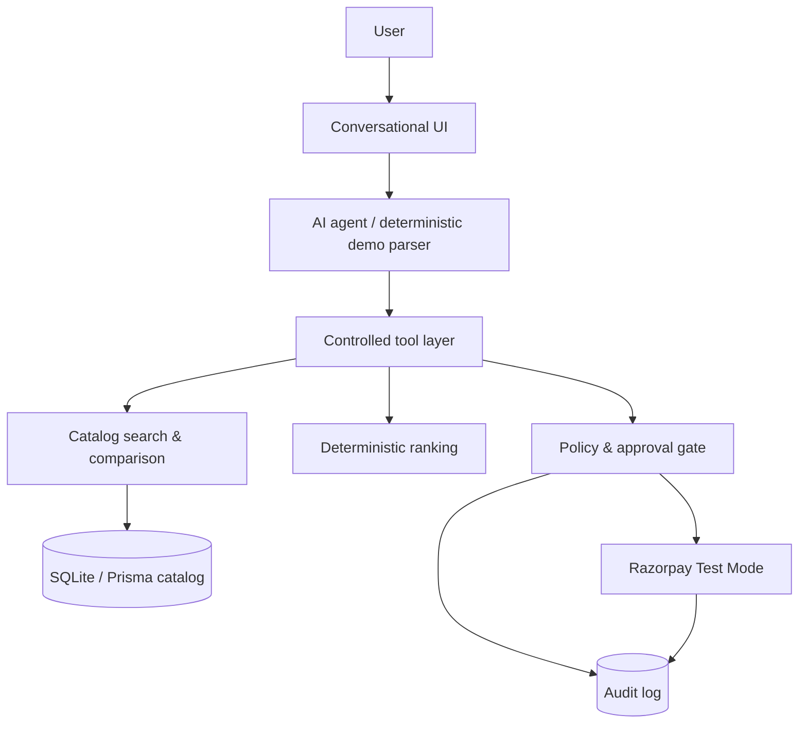

# AgentBuy

AgentBuy is an end-to-end, controlled AI-buyer demo for the **AI Growth & Agentic Commerce** track. It turns a natural-language request into structured catalog search, deterministic ranking, an explicit purchase proposal, a server-side policy check, a Razorpay test order (when configured), and a durable audit trail.

> **Catalog honesty:** the included experience is labeled **Demo / Historical Merchant Catalog**. The intended imported source is historical October 2019 data and is never represented as live Amazon, Flipkart, JioMart, or marketplace pricing.

## Architecture



## Safety boundaries

- Only trusted database prices become an order amount; clients and the AI agent cannot choose it.
- The server checks availability, exact amount, ₹10,000 default policy, approval state, and idempotency key.
- State transitions are explicit: `PENDING_APPROVAL → APPROVED → PAYMENT_CREATED/PAID` or `PAYMENT_FAILED`.
- Demo failure records an unpaid result and never retries automatically.
- Razorpay secret/API keys remain server-only. Without test keys, a clearly-labelled demo payment path keeps the project demonstrable.

## Setup and run

```powershell
npm install
Copy-Item .env.example .env
npm run db:push
npm run db:seed
npm run dev
```

Open http://localhost:3000.

### Import the real catalog

Place `cleaned_dataset.csv` in the project root, then run:

```powershell
npm run import:data
```

The importer validates required fields, validates price/MRP/seller counts, normalizes searchable fields, derives discount percentage, upserts by `Uniq Id`, and prints import statistics. The source CSV is not modified.

### Environment variables

`DATABASE_URL`, `AI_API_KEY`, `RAZORPAY_KEY_ID`, `RAZORPAY_KEY_SECRET`, `NEXT_PUBLIC_RAZORPAY_KEY_ID`, `RAZORPAY_WEBHOOK_SECRET`, and optional `MAX_TRANSACTION_AMOUNT`. **Use Razorpay Test Mode keys only.** Keep the secret and webhook secret server-side; only the `NEXT_PUBLIC_` key may reach the browser.

## Razorpay Test Mode

With all three Razorpay key variables set, AgentBuy creates an order server-side from the trusted catalog price in paise, opens Razorpay Checkout, sends the payment response to the server, validates its order ID and HMAC SHA-256 signature, and only then marks the order paid. Razorpay Test Mode credentials are available from the Razorpay Dashboard’s Test Mode settings.

Configure the webhook URL as `/api/webhooks/razorpay` and set the same webhook secret in `RAZORPAY_WEBHOOK_SECRET`. The raw body signature is verified before a webhook is persisted. Duplicate event IDs (or an identical fallback body hash) are ignored. `payment.captured` and `payment.failed` reconcile delayed payment status.

When Razorpay credentials are absent, the header explicitly says **Demo Payment Mode** and no Razorpay charge/order is implied. Test a successful payment with Razorpay’s Test Mode Checkout credentials; close Checkout or use the failure simulation to exercise the bounded unpaid path.

## APIs

- `GET /api/catalog/search` — structured safe filters (`query`, `category`, `brand`, `maxPrice`, `stockOnly`)
- `GET /api/catalog/products/:id`, `/api/catalog/categories`, `/api/catalog/compare?ids=...`
- `POST /api/agent` — controlled intent-to-search orchestration
- `POST /api/orders`, `/api/orders/:id/approve`, `/api/orders/:id/pay`
- `GET /api/audit`

## Verification

```powershell
npm test
npx tsc --noEmit
npm run build
```

## Demo walkthrough

1. Ask: `I need a skincare product under ₹1,000 with a good discount.`
2. Inspect ranked historical catalog records and select one.
3. Review the server-trusted total and policy limit, then confirm approval.
4. Pay securely (Razorpay test order if keys exist; demo confirmation otherwise).
5. Try **Simulate failure** on an approved proposal to show the bounded unpaid failure path.
6. Open **Audit trail** to review every agent and money-related action.

## Limitations / production next steps

The CSV is not present in this workspace, so the app seeds six transparent demo records until the supplied catalog is imported. The interface includes comparison signals from actual records only; `Seller_Count` is never portrayed as individual seller offers. A production deployment should add authenticated sessions, webhooks/signature completion for Razorpay Checkout, a real LLM tool-calling provider, pagination/full-text search, and PostgreSQL.
